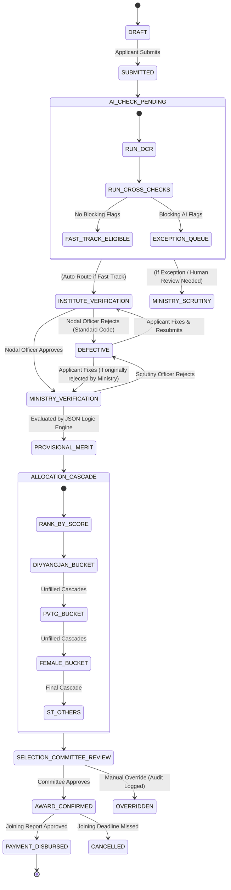

# Application Lifecycle State Diagram

```mermaid
stateDiagram-v2
    [*] --> DRAFT
    
    DRAFT --> SUBMITTED : Applicant Submits
    
    SUBMITTED --> AI_CHECK_PENDING
    
    state AI_CHECK_PENDING {
        [*] --> RUN_OCR
        RUN_OCR --> RUN_CROSS_CHECKS
        RUN_CROSS_CHECKS --> FAST_TRACK_ELIGIBLE : No Blocking Flags
        RUN_CROSS_CHECKS --> EXCEPTION_QUEUE : Blocking AI Flags
    }
    
    AI_CHECK_PENDING --> INSTITUTE_VERIFICATION : (Auto-Route if Fast-Track)
    AI_CHECK_PENDING --> MINISTRY_SCRUTINY : (If Exception / Human Review Needed)
    
    INSTITUTE_VERIFICATION --> DEFECTIVE : Nodal Officer Rejects (Standard Code)
    INSTITUTE_VERIFICATION --> MINISTRY_VERIFICATION : Nodal Officer Approves
    
    DEFECTIVE --> INSTITUTE_VERIFICATION : Applicant Fixes & Resubmits
    DEFECTIVE --> MINISTRY_VERIFICATION : Applicant Fixes (if originally rejected by Ministry)
    
    MINISTRY_VERIFICATION --> PROVISIONAL_MERIT : Evaluated by JSON Logic Engine
    MINISTRY_VERIFICATION --> DEFECTIVE : Scrutiny Officer Rejects
    
    PROVISIONAL_MERIT --> ALLOCATION_CASCADE
    
    state ALLOCATION_CASCADE {
        [*] --> RANK_BY_SCORE
        RANK_BY_SCORE --> DIVYANGJAN_BUCKET
        DIVYANGJAN_BUCKET --> PVTG_BUCKET : Unfilled Cascades
        PVTG_BUCKET --> FEMALE_BUCKET : Unfilled Cascades
        FEMALE_BUCKET --> ST_OTHERS : Final Cascade
    }
    
    ALLOCATION_CASCADE --> SELECTION_COMMITTEE_REVIEW
    
    SELECTION_COMMITTEE_REVIEW --> AWARD_CONFIRMED : Committee Approves
    SELECTION_COMMITTEE_REVIEW --> OVERRIDDEN : Manual Override (Audit Logged)
    
    AWARD_CONFIRMED --> PAYMENT_DISBURSED : Joining Report Approved
    AWARD_CONFIRMED --> CANCELLED : Joining Deadline Missed
    
    PAYMENT_DISBURSED --> [*]
```
